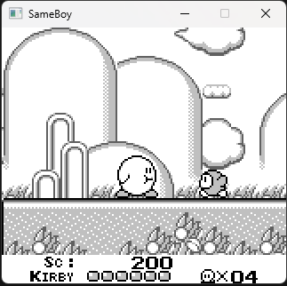

# SameBoy
SameBoy is a gameboy emulator written in C++ only for the purposes of learning, which could be released to the platforms of windows &amp; switch.<br>

<br>


## Build Windows
```
git clone https://github.com/liurui19940222/SameBoy.git
cd win
make
```
In order to run the SameBoy successfully, you need to place the opcodes.txt(switch/romfs/opcodes.txt) in win/bin directory. In addition, make sure have SDL2.dll in your runtime environment.
## Build Switch Homebrew
Make sure you installed devkitPro and can run the MSys2 terminal
```
cd the directory you just cloned
cd switch
make
```
Then switch.nro will be successfully built in the same directory.
